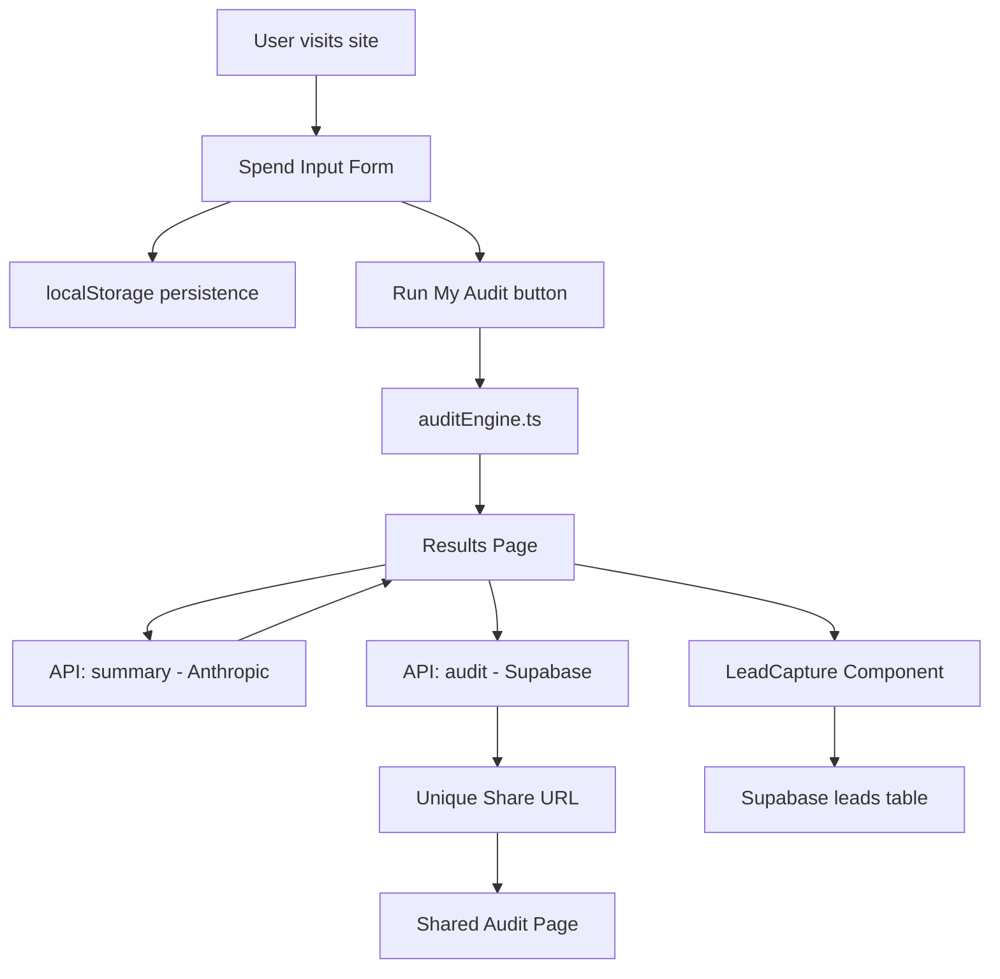

# Architecture

## System Diagram

## Data Flow

1. User fills the spend input form — tool, plan, monthly spend, seats
2. Form state saved to localStorage on every change — persists across reloads
3. On submit, form data passed to `runAudit()` in `auditEngine.ts`
4. Audit engine runs hardcoded rules against pricing data — returns recommendations and savings
5. Results page renders recommendations and simultaneously:
   - Calls summary API — Anthropic generates personalised 100-word summary
   - Calls audit API — saves audit to Supabase, returns unique ID for share URL
6. Lead capture form saves email and optional fields to Supabase leads table
7. Shared audit page fetches from Supabase by ID — personal info not included

## Stack

- **Framework:** Next.js 15 with TypeScript — chosen for API routes, SSR for shared pages, and OG tag support. All MVP requirements needed a backend; Next.js avoids a separate server.
- **Styling:** Tailwind CSS — fastest way to build a clean, consistent dark UI
- **Database:** Supabase (Postgres) — generous free tier, RLS for security, familiar from prior projects
- **AI:** Anthropic Claude Sonnet via API — preferred by assignment, graceful fallback on failure
- **Deployment:** Vercel — zero-config Next.js deployment, auto-deploys on push
- **Testing:** Jest + ts-jest — 7 tests covering audit engine logic
- **CI:** GitHub Actions — runs lint and tests on every push to main

## What I'd Change for 10k Audits/Day

1. **Rate limiting** — Add Redis-based rate limiting on summary and audit APIs to prevent abuse
2. **Caching** — Cache Anthropic API responses for identical inputs to reduce costs
3. **Queue** — Move Anthropic API calls to a background job queue so results page loads instantly
4. **CDN** — Serve shared audit pages from edge cache since they are read-heavy and rarely update
5. **Pricing data** — Move from hardcoded rules to a database-driven pricing table so updates do not require deploys
